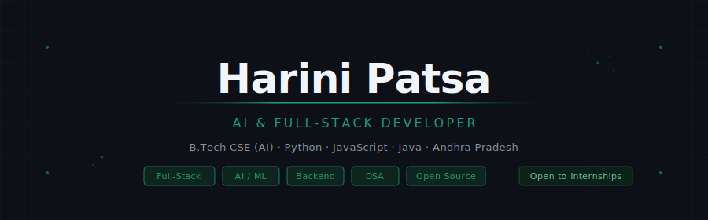

## Harini Patsa

CSE (AI) student · Full-Stack Developer · AI/ML Enthusiast

Building production-grade software with Python, JavaScript, and modern web stacks.
Open to Software Engineering and AI/ML internships.

---

## Tech Stack

Python · Java · JavaScript · React · Node.js · PostgreSQL · MongoDB · Git

---

## Projects

**[EcoCampus — Smart Waste Management](https://smart-campus-waste-management.vercel.app)**
Role-based waste tracking platform with real-time analytics and JWT auth.
`React` `Node.js` `PostgreSQL` `Tailwind`

**[Campus Connect — Student Platform](https://github.com/Harini-0111/electronics-astra-user)**
Dual-database student management system with OTP auth, friend system, and file library.
`Node.js` `PostgreSQL` `MongoDB` `GridFS`

---

## Currently

- Solving DSA problems consistently
- Exploring AI systems and LLM applications
- Building real-world backend projects

---

## Connect

[LinkedIn](https://linkedin.com/in/harini-patsa-3269b0291) · harinipatsa@gmail.com
